## Material

- recap on what's meant by supervised ML
- survey of supervised methods (not including neural networks)

# Recap: what is supervised machine learning?

## Supervised: classification

```{r, echo = FALSE, out.width = "800px",fig.align="center"}
  knitr::include_graphics("figures/supervised_1.png")
```

## Supervised: regression

```{r, echo = FALSE, out.width = "800px",fig.align="center"}
  knitr::include_graphics("figures/supervised_2.png")
```

# Classification via SVM

## Example data

```{r, echo = FALSE, out.width = "800px",fig.align="center"}
  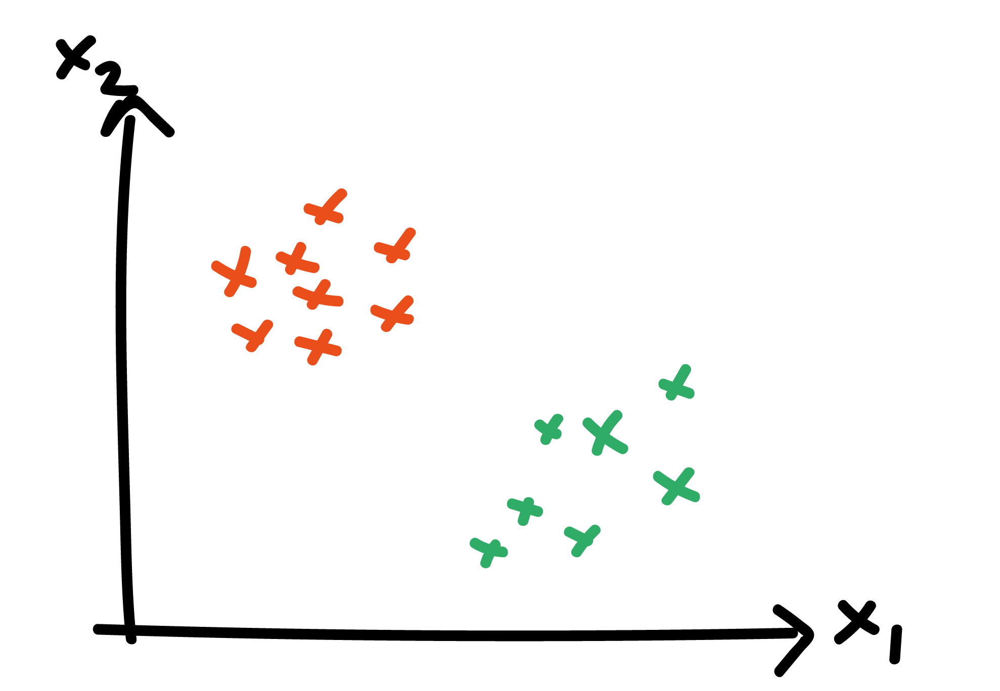
```

## Ideal outcome

- have many labelled tuples of $(x_{1,i}, x_{2,i}, y_i)$ where $y_i\in\{\text{orange},\text{green}\}$
- let: $(\text{orange}, \text{green}) = (+1, -1)$
- suppose there is a joint distribution $p(x_1, x_2, y)$
- want to determine:

\begin{align}
Pr(y=+1|x_1,x_2) &= \frac{p(x_1,x_2|y=+1) Pr(y=+1)}{p(x_1,x_2)}
\end{align}

- optimal *point* classification known as Bayes optimal classifier assigns $y_i=+1$ if:

\begin{equation}
Pr(y=+1|x_1,x_2) > Pr(y=-1|x_1,x_2)
\end{equation}

## Ideal outcome

```{r, echo = FALSE, out.width = "800px",fig.align="center"}
  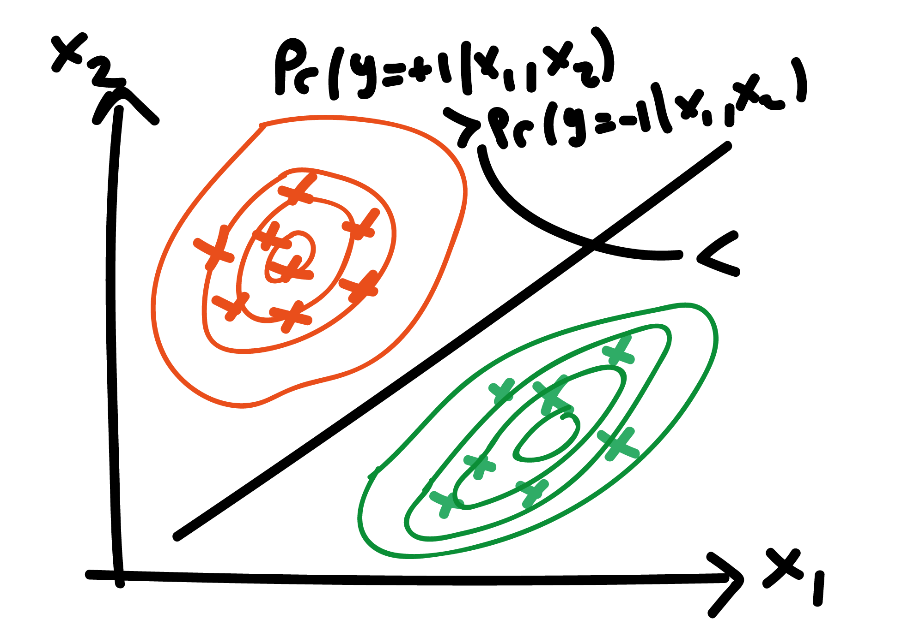
```

## Probability model classifier

- if we have an idea what $p(x_1,x_2|y)$ is (e.g. a normal distribution) can fit these to data from each class $\implies \hat{p}(x_1,x_2|y)$
- along with our chosen priors $\implies \hat{Pr}(y|x_1,x_2)$
- do classification via:

\begin{equation}
\hat{Pr}(y=+1|x_1,x_2) > \hat{Pr}(y=-1|x_1,x_2)
\end{equation}

## Probability model classifier

```{r, echo = FALSE, out.width = "800px",fig.align="center"}
  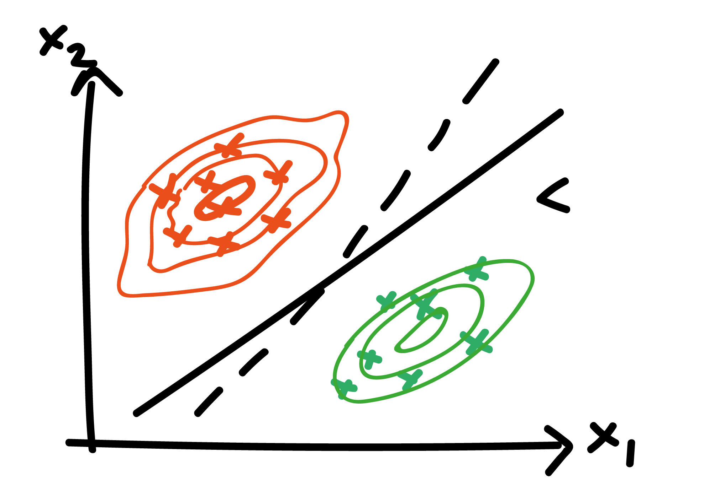
```

## (Linear) SVM approach: model boundary

instead of directly modelling data generation process, model the classification boundary via hyperplane:

\begin{equation}
 w.x - b = 0 
\end{equation}

where $w\in \mathbb{R}^2$, $x\in\mathbb{R}^2$ and $b\in\mathbb{R}$

## Hyperplane equation explainer

```{r, echo = FALSE, out.width = "800px",fig.align="center"}
  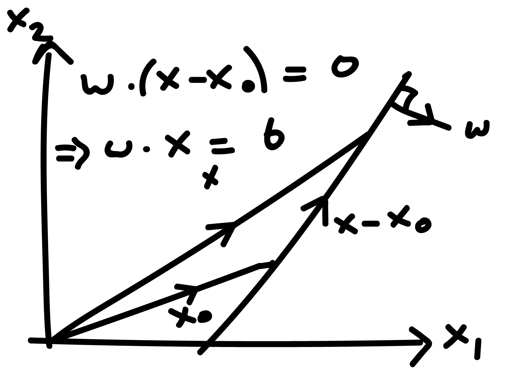
```

## (Linear) SVM approach

classification rule:

\begin{equation}
f(x) = \text{sign}(w.x - b)
\end{equation}

so if $w.x - b > 0\implies f(.)=+1$; else $f(.)=-1$

## Example classification rules

for linearly separable data $(x_i,y_i)$ for $i=1,...,K$:

\begin{align}
w.x_i - b &\geq +1, \; \text{ if } y_i = +1\\
w.x_i - b &\leq -1, \; \text{ if } y_i = -1\\
\end{align}

or, compactly:

\begin{equation}
y_i (w.x_i - b) \geq 1
\end{equation}

## Example classification rules

```{r, echo = FALSE, out.width = "800px",fig.align="center"}
  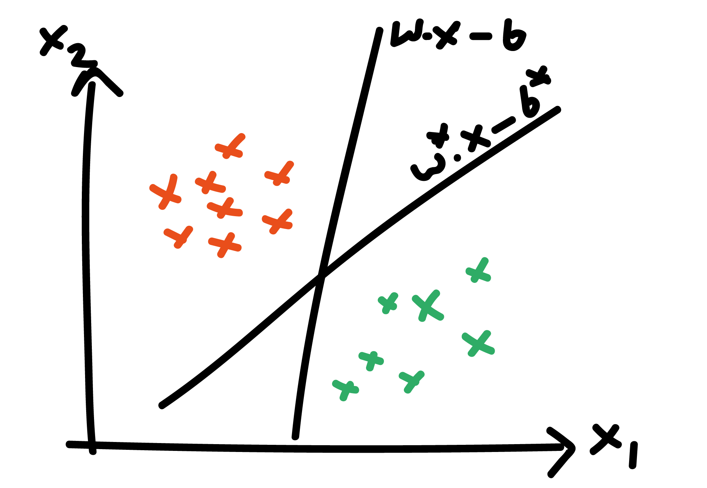
```

## Maximise margin for generalisation

```{r, echo = FALSE, out.width = "800px",fig.align="center"}
  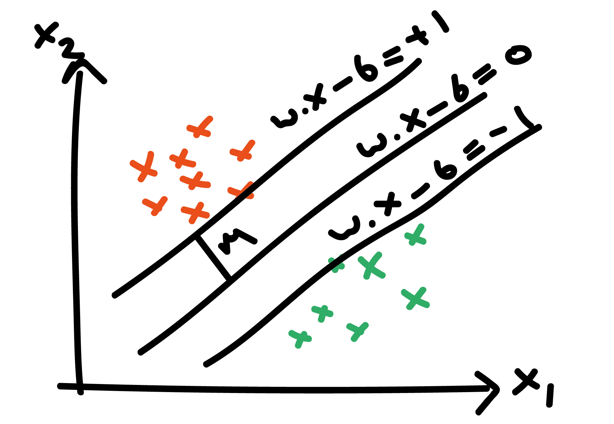
```

## Distance between parallel lines

```{r, echo = FALSE, out.width = "800px",fig.align="center"}
  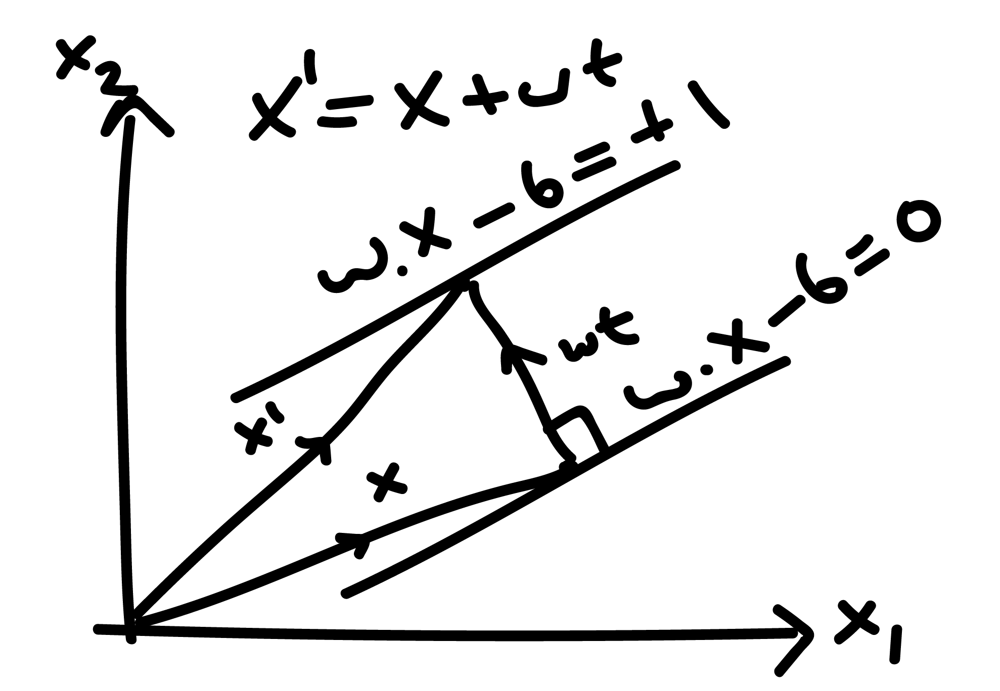
```

## Distance between parallel lines

\begin{equation}
x' = x + wt
\end{equation}

implying:

\begin{equation}
w.x' = w.(x + wt) = 1 + b
\end{equation}

which, when rearranged, yields:

\begin{equation}
|w|^2 t = 1 - b - w.x = 1 + b - b = 1
\end{equation}

## Distance between parallel lines

So

\begin{equation}
t = \frac{1}{|w|^2}
\end{equation}

meaning that:

\begin{equation}
x' = x + w \frac{1}{|w|^2}
\end{equation}

and the distance is given by:

\begin{equation}
|x'-x| = \frac{1}{|w|}
\end{equation}


## Optimisation problem

Optimal hyperplane equation is solution of:

\begin{equation}
\text{min }|w|, \text{s.t. } y_i (w.x_i - b) \geq 1, \text{ for } i = 1,...,K
\end{equation}

which is actually easier to solve as a quadratic programming problem:

\begin{equation}
\text{min }\frac{1}{2}|w|^2, \text{s.t. } y_i (w.x_i - b) \geq 1, \text{ for } i = 1,...,K
\end{equation}

## Non-linearly separable data

```{r, echo = FALSE, out.width = "800px",fig.align="center"}
  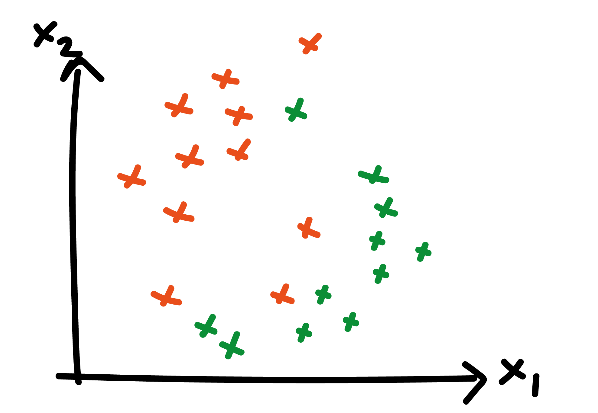
```

## Need a new cost function

\begin{equation}
y_i (w.x_i - b) \geq 1
\end{equation}

no longer possible for $i = 1,...,K$. Instead define the following hinge loss function:

\begin{equation}
L = \frac{1}{K}\sum_{i=1}^{K}\text{max}(0, 1 - y_i (w.x_i - b))
\end{equation}

here $L_i=0$ is points are correctly classified; and $L_i = 1 - y_i (w.x_i - b)$ measures distance from decision boundary for misclassified points

## Minimising L

```{r, echo = FALSE, out.width = "800px",fig.align="center"}
  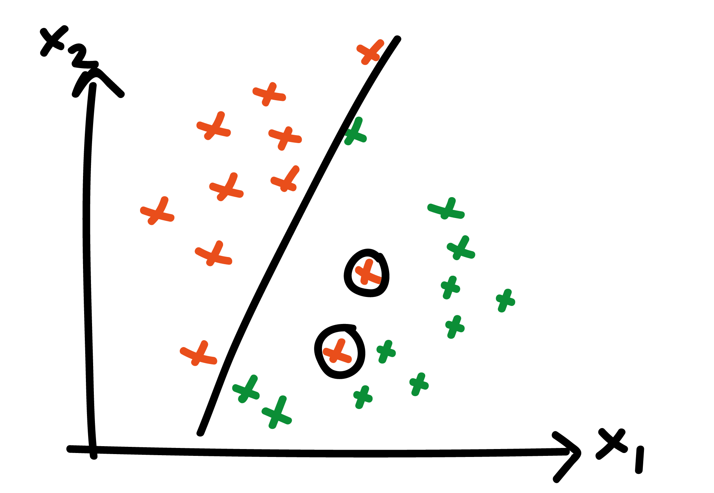
```

## Alternative loss function: with regularisation

\begin{equation}
H = C|w|^2 + \frac{1}{K}\sum_{i=1}^{K}\text{max}(0, 1 - y_i (w.x_i - b))
\end{equation}

where $C$ controls importance of having a large margin between (most of) both classes. $C$ is chosen as part of hyperparameter optimisation

## Minimising H with reasonable C

```{r, echo = FALSE, out.width = "800px",fig.align="center"}
  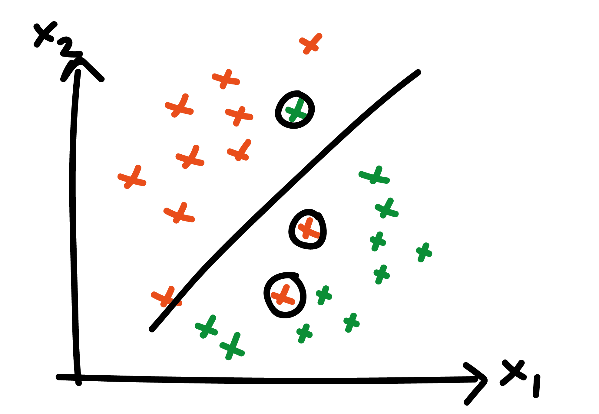
```

## Non-linear SVM boundary

```{r, echo = FALSE, out.width = "1000px",fig.align="center"}
  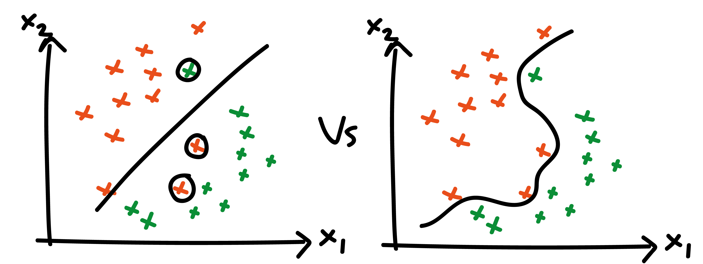
```

## How to achieve non-linear boundary?

- points non-linearly separable in (say) 2D can be separated in higher dimensions
- so we make a transformation from (say) 2D to higher dimensions, then do linear SVM there

## 1D example

```{r, echo = FALSE, out.width = "1000px",fig.align="center"}
  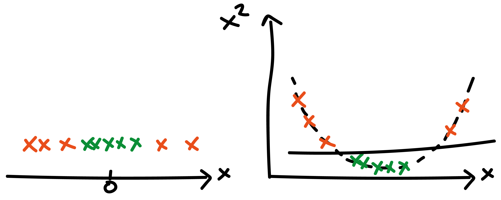
```

## 2D example

```{r, echo = FALSE, out.width = "1000px",fig.align="center"}
  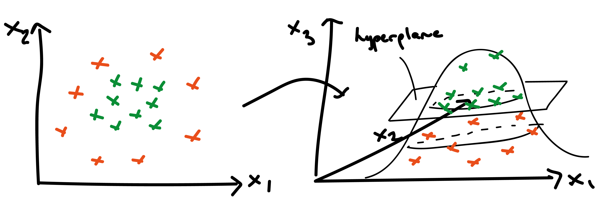
```

## Issue with non-linear boundary

- with more functional freedom comes more complexity
- greater chance that your classification boundaries reflect noise of training set
- lower generalisability

## SVM summary

- instead of explicitly modelling conditional probability distributions, SVMs model boundaries
- in linear SVM, a hyperplane is sought that separates data
- this results in a quadratic programming problem
- transforming to higher dimensions yields non-linear boundaries in original space
- non-linear boundaries improves prediction but can overfit data

## Questions?

# Linear regression

## Example data

```{r, echo = FALSE, out.width = "800px",fig.align="center"}
  knitr::include_graphics("figures/supervised-regression-1.png")
```

## Probabilistic model

Suppose

\begin{equation}
y_i|x_i \sim \mathcal{N}(\alpha + \beta x_i, \sigma),
\end{equation}

where $(\alpha, \beta, \sigma)$ are parameters to be learned

## What does this model look like?

```{r, echo = FALSE, out.width = "1000px",fig.align="center"}
  knitr::include_graphics("figures/supervised-regression-2.png")
```

## How to estimate model?

assume $\boldsymbol{y}=(y_1,y_2,...,y_K)$ and $\boldsymbol{x}=(x_1,x_2,...,x_K)$ 

\begin{equation}
p(\alpha,\beta,\sigma|\boldsymbol{y},\boldsymbol{x}) \propto p(\boldsymbol{y}|\boldsymbol{x},\alpha, \beta,\sigma) p(\alpha,\beta,\sigma)
\end{equation}

use these to determine posterior predictive distribution describing new $\tilde{\boldsymbol{y}}$ for given (new) $\tilde{\boldsymbol{x}}$:

\begin{equation}
p(\tilde{\boldsymbol{y}}|\tilde{\boldsymbol{x}}) = \int p(\tilde{\boldsymbol{y}}|\tilde{\boldsymbol{x}},\alpha, \beta,\sigma) p(\alpha,\beta,\sigma|\boldsymbol{y},\boldsymbol{x}) d\alpha\;d\beta\;d\sigma
\end{equation}

typically would be done via Markov chain Monte Carlo

## Alternative (non-probabilistic) model

\begin{equation}
y_i = \alpha + \beta x_i + \epsilon_i
\end{equation}

where $\epsilon_i$ is an error term. Define mean-squared loss:

\begin{equation}
L = \frac{1}{K} \sum_{i=1}^{K} (y_i - (\alpha + \beta x_i))^2
\end{equation}


## What does this model look like?

```{r, echo = FALSE, out.width = "1000px",fig.align="center"}
  knitr::include_graphics("figures/supervised-regression-3.png")
```

## Learning parameters

determine $\hat{\alpha}$ and $\hat{\beta}$ as those minimising $L$:

\begin{align}
\frac{\partial L}{\partial \alpha} &= -\frac{2}{K}\sum_{i=1}^{K} (y_i - (\alpha + \beta x_i)) = 0\\
\frac{\partial L}{\partial \beta} &= -\frac{2}{K}\sum_{i=1}^{K} x_i (y_i - (\alpha + \beta x_i)) = 0
\end{align}

## Gradient descent

although a closed form expression exists for $\hat{\alpha}$ and $\hat{\beta}$, for more general models, one doesn't exist $\implies$ use gradient descent optimisation

1. initialise parameters $\alpha=\alpha_0$, $\beta=\beta_0$
2. in each epoch update parameters:

\begin{align}
\alpha &= \alpha - \eta \frac{\partial L}{\partial \alpha}\\
\beta &= \beta - \eta \frac{\partial L}{\partial \beta}
\end{align}

until $\alpha$ and $\beta$ no longer change. $\eta$ is the learning rate

## Linear regression with polynomial terms

alternative model:

\begin{equation}
y_i|x_i \sim \mathcal{N}(f_p(x_i), \sigma),
\end{equation}

where

\begin{equation}
f_p(x_i) = \theta_0 + \theta_1 x_i + \theta_2 x_i^2 + ... + \theta_p x_i^p
\end{equation}

model is better able to fit more complex datasets

## Is this a good fit?

```{r, echo = FALSE, out.width = "800px",fig.align="center"}
  knitr::include_graphics("figures/supervised-regression-4.png")
```

## What went wrong?

- adding more parameters always reduces error on training set
- but results in a model that generalises poorly

## What is a good fitting model?

```{r, echo = FALSE, out.width = "1000px",fig.align="center"}
  knitr::include_graphics("figures/supervised-regression-5.png")
```

## Solutions

- need a separate validation set (more this afternoon) to test model predictions on
- regularisation can help too, yielding a new objective function:

\begin{equation}
L = C||\theta||_q + \frac{1}{K} \sum_{i=1}^{K} (y_i - f_p(x_i))^2
\end{equation}

where $||.||_q$ denotes the $Lq$ norm: different choices can yield very different estimates

## Linear regression summary

- linear regression defines a loss function (typically mean squared error) between actual and predicted observations
- training can be done via gradient descent: each epoch corresponds to a single parameter update
- (gradient descent also used to train many other methods, like neural nets)
- fitting regression with more complex functional forms can fit more complex data
- but risks poor generalisation

# Logistic regression

## Logistic regression

- confusingly, this is a classifier not a regression (in the ML sense)
- models data as generated from a Bernoulli probability distribution
- probability parameter of Bernoulli modelled by logistic function, hence the name
- simple classifier but yields interpretable results and can be estimated in Bayesian framework

## Model for binary data

- suppose we have many labelled tuples of $(x_{i}, y_i)$
- where $y_i$ is binary: here, we set $y_i=0$ for one category; $y_i=1$ for the other
- since outcome is binary $\implies$ use an appropriate probability distribution:

\begin{equation}
y_i \sim \text{Bernoulli}(\theta_i)
\end{equation}

where $0\leq \theta_i \leq 1 = Pr(y_i=1)$

## Bernoulli probability distribution

is given by:

\begin{equation}
\text{Pr}(y_i|\theta_i) = \theta_i^{y_i} (1 - \theta_i)^{1 - y_i}
\end{equation}

so that $\text{Pr}(y_i=1) = \theta_i$ and $\text{Pr}(y_i=0) = 1 - \theta_i$

## Logistic function

In logistic regression, we use logistic function:

\begin{equation}
\theta_i = f_\beta(x_i) := \frac{1}{1 + \exp (-(\beta_0 + \beta_1 x_i))}
\end{equation}

```{r, echo = FALSE, out.width = "600px",fig.align="center"}
  knitr::include_graphics("figures/logistic-regression.png")
```

## Likelihood and Bayesian estimation

assume data are i.i.d., the likelihood is:

\begin{equation}
L=p(\boldsymbol{y}|\beta,\boldsymbol{x}) = \prod_{i=1}^{K} f_\beta(x_i)^{y_i} (1 - f_\beta(x_i))^{1 - y_i}
\end{equation}

setting priors, we have a Bayesian model:

\begin{equation}
p(\beta|\boldsymbol{x}, \boldsymbol{y}) \propto p(\beta) p(\boldsymbol{y}|\beta,\boldsymbol{x})
\end{equation}

so can use (say) Markov chain Monte Carlo to estimate model with uncertainty. Frequentists use gradient descent to find maximum likelihood estimates instead

## Multivariate logistic regression

straightforward to extend the model to incorporate multiple regressions:

\begin{equation}
f_\beta(x_i) := \frac{1}{1 + \exp (-(\beta_0 + \beta_1 x_{1,i} + ... + \beta_p x_{p,i}))}
\end{equation}

But how to interpret parameters of logistic regression?

## Log-odds ratios

another way of writing logistic function:

\begin{align}
f_\beta(x_i) &= \frac{1}{1 + \exp (-(\beta_0 + \beta_1 x_{1,i} + ... + \beta_p x_{p,i}))}\\
&= \frac{\exp (\beta_0 + \beta_1 x_{1,i} + ... + \beta_p x_{p,i})}{1 + \exp (\beta_0 + \beta_1 x_{1,i} + ... + \beta_p x_{p,i})}
\end{align}

so that

\begin{align}
1 - f_\beta(x_i) = \frac{1}{1 + \exp (\beta_0 + \beta_1 x_{1,i} + ... + \beta_p x_{p,i})}
\end{align}

## Log-odds ratios

taking the ratio:

\begin{equation}
\text{odds} = \frac{f_\beta(x_i)}{1-f_\beta(x_i)} = \exp (\beta_0 + \beta_1 x_{1,i} + ... + \beta_p x_{p,i})
\end{equation}

so that

\begin{equation}
\log\text{odds} =\beta_0 + \beta_1 x_{1,i} + ... + \beta_p x_{p,i}
\end{equation}

meaning (say) $\beta_1$ represents the change in log-odds for a one unit change in $x_{1}$

## Logistic regression summary

- logistic regression models are binary classifiers (in ML speak)
- assumes Bernoulli distribution for outputs
- logistic function used to relate changes in inputs to outputs
- estimatable via Bayesian inference
- multivariate logistic regression is a commonly used tool

## Questions?

# K-nearest neighbours: classification and regression

## KNN

- non-model-based learning algorithm
- keeps training data in memory when making predictions, in contrast to most other methods
- generally fast to run compared to many model-based approaches
- straightforward premise for both classification and regression

## KNN classification

for new data point $\tilde x_i$:

1. find $k$ nearest $x$ values from training data $(x_i, y_i)$ for $i=1,...,n$
2. tally up the corresponding $y$ labels: $(y_1,..,y_k)$
3. classify $\tilde x_i \rightarrow \text{mode}(y_1,..,y_k)$

## KNN regression

for new data point $\tilde x_i$:

1. find $k$ nearest $x$ values from training data $(x_i, y_i)$ for $i=1,...,n$
2. tally up the corresponding $y$ labels: $(y_1,..,y_k)$
3. classify $\tilde x_i \rightarrow \text{mean}(y_1,..,y_k)$

## Distance metrics

many options possible. Common metrics include:

- Euclidean: $s(x_1,x_2) = \sqrt{\sum_{i=1}^{D} (x_{1,i} - x_{2,i})^2}$
- cosine similarity:

\begin{equation}
s(x_1,x_2) = \frac{x_1.x_2}{|x_1||x_2|}
\end{equation}

## Example data

```{r, echo = FALSE, warning=FALSE, message=FALSE}
library(RANN)
library(tidyverse)
n <- 200
x <- rnorm(n, 0, 4)
y <- sin(x) + rnorm(n, 0, 0.2)

f_kk_regression <- function(x_tilde, x, y, k=10) {
  fit <- nn2(x, c(x_tilde), k = k)
  idxs <- fit$nn.idx[1, ]
  return(mean(y[idxs]))
}

x_sim <- seq(-10, 10, 0.1)
y_sim <- map_dbl(x_sim, ~f_kk_regression(., x, y))

df <- tibble(x, y) %>% 
  mutate(type="actual") %>% 
  bind_rows(tibble(x=x_sim, y=y_sim) %>% mutate(type="regression"))

p <- ggplot(df %>% filter(type=="actual"), aes(x=x, y=y)) +
  geom_point()
p
```

## KNN with k=10
```{r, echo = FALSE, warning=FALSE, message=FALSE}
 p + geom_line(data=df %>% filter(type=="regression"), colour="blue")
```

## KNN with k=1
```{r, echo = FALSE, warning=FALSE, message=FALSE}
y_sim <- map_dbl(x_sim, ~f_kk_regression(., x, y, k = 2))

df <- tibble(x, y) %>% 
  mutate(type="actual") %>% 
  bind_rows(tibble(x=x_sim, y=y_sim) %>% mutate(type="regression"))

p + geom_line(data=df %>% filter(type=="regression"), colour="blue")
```

## KNN with k=50
```{r, echo = FALSE, warning=FALSE, message=FALSE}
y_sim <- map_dbl(x_sim, ~f_kk_regression(., x, y, k = 50))

df <- tibble(x, y) %>% 
  mutate(type="actual") %>% 
  bind_rows(tibble(x=x_sim, y=y_sim) %>% mutate(type="regression"))

p + geom_line(data=df %>% filter(type=="regression"), colour="blue")
```

## Issue with KNN

assume

\begin{equation}
\boldsymbol{x} \sim \mathcal{N}(0, I)
\end{equation}

where $I\in\mathbb{R}^d$. What does the distribution of Euclidean distances between points look like as $d$ changes?

## Distance dists: neighbours not near in higher D
```{r, echo = FALSE, warning=FALSE, message=FALSE, out.width = "650px"}
library(mvtnorm)
rmvrnormND <- function(n, d){
  return(rmvnorm(n, mean = rep(0, d)))
}

rcubeND <- function(n, d) {
  m_vals <- runif(n * d)
  return(matrix(m_vals, ncol = d))
}

f_dists <- function(n, d) {
  x_2 <- rmvrnormND(n, d)
  m_dist <- dist(x_2) %>% as.matrix()
  return(tibble(dist=m_dist[upper.tri(m_dist, diag=FALSE)],
                dimension=d))
}

n <- 200
x_2 <- f_dists(n, 2)
x_3 <- f_dists(n, 3)
x_5 <- f_dists(n, 5)
x_10 <- f_dists(n, 100)

x_2 %>% 
  bind_rows(x_3) %>% 
  bind_rows(x_5) %>% 
  bind_rows(x_10) %>% 
  ggplot(aes(x=dist)) +
  geom_histogram(bins=200) +
  facet_wrap(~dimension) +
  theme(strip.text = element_text(size=16),
        axis.text = element_text(size=16),
        axis.title = element_text(size=16)) +
  xlab("Distance")
```

## KNN summary

- KNN uses a simple device to do both classification and regression
- in both cases taken the $k$ closest points to choose label or value
- $k$ controls the smoothness of predictions
- generally cheaper to run than other models
- in higher dimensions, less useful

## Questions?

# Decision tree methods

## What is a decision tree?
```{r, echo = FALSE, out.width = "800px",fig.align="center"}
  knitr::include_graphics("figures/decision_tree.png")
```

## Example data
```{r, echo = FALSE, warning=FALSE, message=FALSE}
library(kableExtra)
df <- tibble(patient=seq(1, 5, 1),
             "breathing issue (B)"=c(1, 1, 0, 0, 0),
             "high temp (T)"=c(1, 0, 0, 1, 1),
             "loss taste (L)"=c(1, 1, 1, 1, 0),
             covid=c(0, 1, 1, 0, 1))
kable(df ,format="html",escape = F) %>% 
  kable_styling() %>%
  kableExtra::scroll_box(width = "100%", height = "400px")
```


## Structure of decision tree

- want to build a tree to determine whether a patient has covid, $C=1$
- this tree may be a function of their symptoms, $\boldsymbol{x}$
- define tree $f(\boldsymbol{x})$ as

\begin{equation}
f(\boldsymbol{x}):=\text{Pr}(C=1|\boldsymbol{x}) := \frac{1}{|\mathcal{S}(\boldsymbol{x})|} \sum_{i\in \mathcal{S}(\boldsymbol{x})} C_i
\end{equation}

where $\mathcal{S}(\boldsymbol{x})$ is the set of individuals with symptoms $\boldsymbol{x}$

## Example decision tree(s)

\begin{align}
f(\emptyset) &= \frac{3}{5}\\
f(B=1) &= \frac{1}{2}\\
f(B=1,T=1) &= 0\\
\end{align}

```{r, echo = FALSE, warning=FALSE, message=FALSE}
kable(df ,format="html",escape = F) %>% 
  kable_styling() %>%
  kableExtra::scroll_box(width = "100%", height = "400px")
```

## How to build a decision tree?

- need to choose "good" splits at every point in tree
- but how to evaluate whether a split is good?
- ID3 algorithm provides an approach for determining splits

## Good split?

- a split is good if it leads to the greatest reduction in uncertainty (i.e. entropy)
- for a Bernoulli variable (like our example):

\begin{equation}
H = -\sum_{i=1}^{2} p_i \log p_i = -(p \log p + (1 - p) \log (1-p))
\end{equation}


```{r, echo = FALSE, warning=FALSE, message=FALSE, out.width = "400px"}
theta <- seq(0, 1, length.out = 100)
H <- map_dbl(theta, ~-(. * log(.) + (1 - .) * log(1 - .)))
tibble(p=theta, H) %>% 
  ggplot(aes(x=p, y=H)) +
  geom_line() +
  xlab("p") +
  ylab("H") +
  theme(axis.title = element_text(size=20),
        axis.text = element_text(size=20))
```

## Initial split

define $H(D|a)$ as the conditional entropy after splitting on a given variable $a$ for training data $D$:

\begin{equation}
H(D|a) = \sum_{v\in\text{vals}(a)} \frac{|\mathcal{S}(v)|}{|\mathcal{S}(\emptyset)|} H(\mathcal{S}(v))
\end{equation}

when we start, we have entropy:

\begin{equation}
H(\phi) = -3/5\log (3/5) - 2/5 \log (2/5) \approx 0.97
\end{equation}

## Splitting on $B$

\begin{align}
H(D|B) &= 3/5 H(B=0) + 2/5 H(B=1)\\
&= 3/5 (-2/3\log(2/3) - 1/3\log(1/3))\\
\;\;& + 2/5 (-1/2\log(1/2) - 1/2\log(1/2)) \approx 0.95
\end{align}

```{r, echo = FALSE, warning=FALSE, message=FALSE}
kable(df ,format="html",escape = F) %>% 
  kable_styling() %>%
  kableExtra::scroll_box(width = "100%", height = "200px")
```

## Splitting on $T$

\begin{align}
H(D|T) &= 2/5 H(T=0) + 3/5 H(T=1)\\
&= 2/5 (0)\\
\;\;& + 3/5 (-2/3\log(2/3) - 1/3\log(1/3)) \approx 0.55
\end{align}

```{r, echo = FALSE, warning=FALSE, message=FALSE}
kable(df ,format="html",escape = F) %>% 
  kable_styling() %>%
  kableExtra::scroll_box(width = "100%", height = "200px")
```

## Splitting on $L$

\begin{align}
H(D|L) &= 1/5 H(L=0) + 4/5 H(L=1)\\
&= 1/5 (0)\\
\;\;& + 4/5 (-1/2\log(1/2) - 1/2\log(1/2)) = 0.8
\end{align}

```{r, echo = FALSE, warning=FALSE, message=FALSE}
kable(df ,format="html",escape = F) %>% 
  kable_styling() %>%
  kableExtra::scroll_box(width = "100%", height = "200px")
```

## Splitting options summarised

initial entropy $\approx$ 0.97. After splitting:

- on $B$: $H(D|B)\approx 0.95$
- on $T$: $H(D|T) \approx 0.55$
- on $L$: $H(D|L) = 0.80$

so splitting on $T$ is optimal

## Algorithm continues splitting until

- all examples in leaf node are correctly classified
- there are no more attributes to split on
- the split reduces entropy less than threshold (a hyperparameter)
- tree reaches a maximum depth (another hyperparameter)

## Decision trees can also handle regression

tree still defined as:

\begin{equation}
f(x) := \frac{1}{|\mathcal{S}(\boldsymbol{x})|} \sum_{i\in \mathcal{S}(\boldsymbol{x})} y_i
\end{equation}

but $y_i\in\mathbb{R}$ and split based on reduction of standard deviation in $y$ opposed to entropy

## Random forests

## Random forests: ensemble of decision trees

\begin{equation}
f(\boldsymbol{x}) = \text{mode} \bigcup\limits_{b=1}^{B} f_b(\boldsymbol{x})
\end{equation}

where $f_b(\boldsymbol{x})$ is a decision tree trained on a random sample (with replacement) drawn from original training set; there are $B$ such samples. Process known as "bagging"

## Idea behind weak ensembles

- individual trees are noisy but (if deep enough) unbiased
- averaging predictions across many trees reduces variance
- so long as those trees tend to be wrong in different ways
- i.e. they are uncorrelated

## Analogy

estimating mean height of individuals in population

- option 1: sample families $\implies$ higher correlation
- option 2: sample individuals $\implies$ lower correlation 
 
## Avoiding "correlated" trees

- if a few variables are strong predictors $\implies$ most trees will split on these
- RFs reduce this by only allowing each to split on random subset of predictors

## Correlated and less correlated trees
```{r, echo = FALSE, out.width = "800px",fig.align="center"}
  knitr::include_graphics("figures/random_forest_correlation.png")
```

## Hyperparameters of RFs

- number of trees: often just set to a high value
- number of randomly selected predictors for each trees: $m_{\text{try}} \approx \sqrt{\text{# features}}$

## Gradient boosting

## Regression example

assume start with naive model:

\begin{equation}
f_0 = \frac{1}{K}\sum_{i=1}^{K} y_i
\end{equation}

calculate residuals:

\begin{equation}
\hat{y_i} = y_i - f_0
\end{equation}

train new model $f(x_i)$ on $\hat{y_i}$ $\implies f_1$

## Regression example

new predictor becomes:

\begin{equation}
f(x_i) := f_0 + \alpha f_1(x_i)
\end{equation}

where $\alpha$ is learning rate (a hyperparameter). Now calculate new residuals:

\begin{equation}
\hat{y_i} = y_i - f(x_i)
\end{equation}

and fit second decision tree to it; and so on. Iterative process of improving models known as boosting

## Bagging versus boosting
```{r, echo = FALSE, out.width = "800px",fig.align="center"}
  knitr::include_graphics("figures/boosted_vs_bagging.png")
```

## Hyperparameters of gradient boosted models

boosting parameters:

- number of trees
- learning rate

tree parameters:

- tree depth
- minimum number of observations in terminal nodes

## Summary: comparing RFs with gradient boosted models

- both methods involve ensembles of decision trees
- RFs are straightforward to tune and training can be parallelised
- gradient boosted models (most recent version: XGBoost) require more attention to tune properly and hard to parallelise
- both offer best performance from non-deep learning approaches; typically part of winning Kaggle competitions
- XGBoost typically offers best performance

## Questions?

# Overall perspective

## Inference versus supervised ML

- both assume rich data is driven by simpler processes
- both inference and ML use data to build models of processes
- both expect model complexity to increase with volume of data

## Spectrum from inference to prediction

```{r, echo = FALSE, out.width = "800px",fig.align="center"}
  knitr::include_graphics("figures/spectrum.png")
```

## Where are model classes on spectrum?

```{r, echo = FALSE, out.width = "800px",fig.align="center"}
  knitr::include_graphics("figures/spectrum1.png")
```

## Problem with most ML approaches

- ensembling models attempts to incorporate structural uncertainty (poorly)
- 95%+ of applied ML ignores uncertainty in model
- (probability outputted by classifiers is assumed ontological not epistemiological)

## Why uncertainty matters?

- forecasting
- learning from imperfect data
- extrapolating to new data regimes
- (read Yarin Gal's introduction to his thesis)

# Summary

## Summary

- there are lots of ML methods (and we only touched a few)
- intuition behind many methods is relatively simple
- almost all methods have hyperparameters that need to be tuned
- important to choose appropriate model complexity
- be wary of implied lack of uncertainty in models

## Questions?

---


